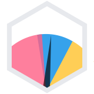
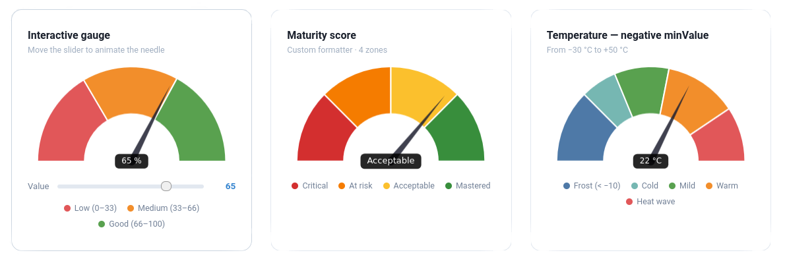

#  chartjs-gauge

A [Chart.js](https://www.chartjs.org/) plugin that adds a **gauge chart** type — a half-doughnut with an animated needle and a configurable value label.

[](https://www.npmjs.com/package/@sourcentis/chartjs-gauge)
[](https://packagist.org/packages/sourcentis/chartjs-gauge)
[](https://github.com/sourcentis/chartjs-gauge/blob/HEAD/LICENSE)



---

## Features

- **Gauge chart type** (`type: 'gauge'`) built on Chart.js's doughnut controller
- **Animated needle** with configurable radius, width, length, and color
- **Value label** with custom formatter, background, border-radius, padding, and color
- Supports **`minValue`** to offset the gauge starting point
- Per-dataset **`needle`** override — multiple needles in one chart
- Compatible with **Chart.js v4**
- Works as a **Laravel Composer package** (publishes pre-built assets) or a **standalone npm package**

---

## Installation

### npm / yarn

```bash
npm install chart.js @sourcentis/chartjs-gauge
# or
yarn add chart.js @sourcentis/chartjs-gauge
```

### Composer (Laravel)

```bash
composer require sourcentis/chartjs-gauge
```

Then publish the pre-built assets:

```bash
php artisan vendor:publish --tag=chartjs-gauge-assets
```

This copies the `dist/` files to `public/vendor/chartjs-gauge/`.

---

## Quick Start

### ES module (Vite / webpack)

```js
import { Chart } from "chart.js";
import "@sourcentis/chartjs-gauge"; // auto-registers the controller

const ctx = document.getElementById("myGauge");

new Chart(ctx, {
    type: "gauge",
    data: {
        datasets: [{
            value: 65,                                          // needle position
            data: [33, 66, 100],                               // segment boundaries
            backgroundColor: ["#E15759", "#F28E2B", "#59A14F"],
        }],
    },
    options: {
        needle: {
            radiusPercentage: 2,
            widthPercentage: 3.2,
            lengthPercentage: 80,
            color: "rgba(0, 0, 0, 1)",
        },
        valueLabel: {
            display: true,
            formatter: (value) => `${value}%`,
            color: "rgba(255, 255, 255, 1)",
            backgroundColor: "rgba(0, 0, 0, 0.8)",
        },
    },
});
```

### CDN (UMD)

```html
<script src="https://cdn.jsdelivr.net/npm/chart.js@4/dist/chart.umd.min.js"></script>
<script src="https://cdn.jsdelivr.net/npm/@sourcentis/chartjs-gauge@latest/dist/chartjs-gauge.min.js"></script>

<canvas id="myGauge"></canvas>
<script>
    new Chart(document.getElementById("myGauge"), {
        type: "gauge",
        data: {
            datasets: [{
                value: 65,
                data: [33, 66, 100],
                backgroundColor: ["#E15759", "#F28E2B", "#59A14F"],
            }],
        },
    });
</script>
```

---

## Live Demo

Interactive examples — loaded via CDN, no build step required.

<script src="https://cdn.jsdelivr.net/npm/chart.js@4/dist/chart.umd.min.js"></script>
<script src="https://cdn.jsdelivr.net/npm/@sourcentis/chartjs-gauge@latest/dist/chartjs-gauge.min.js"></script>

<style>
.demo-grid {
    display: grid;
    grid-template-columns: repeat(auto-fill, minmax(280px, 1fr));
    gap: 24px;
    margin: 24px 0;
}
.demo-card {
    background: #fff;
    border: 1px solid #e1e4e5;
    border-radius: 8px;
    padding: 20px 16px 24px;
}
.demo-card h3 {
    font-size: 0.95rem;
    font-weight: 600;
    margin: 0 0 4px;
    color: #333;
    border: none;
}
.demo-card p {
    font-size: 0.78rem;
    color: #888;
    margin: 0 0 14px;
}
.demo-card canvas { display: block; }
.slider-row {
    display: flex;
    align-items: center;
    gap: 10px;
    margin-top: 10px;
}
.slider-row label { font-size: 0.8rem; color: #555; white-space: nowrap; }
input[type=range] {
    flex: 1;
    -webkit-appearance: none;
    height: 5px;
    border-radius: 3px;
    background: #ddd;
    outline: none;
    cursor: pointer;
}
input[type=range]::-webkit-slider-thumb {
    -webkit-appearance: none;
    width: 16px; height: 16px;
    border-radius: 50%;
    background: #2980b9;
    cursor: pointer;
}
.slider-val { font-size: 0.82rem; font-weight: 700; color: #2980b9; min-width: 32px; text-align: right; }
.demo-legend {
    display: flex;
    flex-wrap: wrap;
    gap: 5px 12px;
    margin-top: 8px;
    justify-content: center;
}
.demo-legend span {
    display: flex;
    align-items: center;
    gap: 4px;
    font-size: 0.74rem;
    color: #777;
}
.demo-legend i {
    width: 8px; height: 8px;
    border-radius: 50%;
    display: inline-block;
    flex-shrink: 0;
}
</style>

<div class="demo-grid">

  <!-- 1. Interactive -->
  <div class="demo-card">
    <h3>Interactive</h3>
    <p>Move the slider to animate the needle</p>
    <canvas id="d-interactive"></canvas>
    <div class="slider-row">
      <label>Value</label>
      <input type="range" id="d-slider" min="0" max="100" value="65">
      <span class="slider-val" id="d-slider-val">65</span>
    </div>
    <div class="demo-legend">
      <span><i style="background:#E15759"></i>Low (0–33)</span>
      <span><i style="background:#F28E2B"></i>Medium (33–66)</span>
      <span><i style="background:#59A14F"></i>Good (66–100)</span>
    </div>
  </div>

  <!-- 2. Maturity score -->
  <div class="demo-card">
    <h3>Maturity score</h3>
    <p>4 zones · text formatter</p>
    <canvas id="d-maturity"></canvas>
    <div class="demo-legend">
      <span><i style="background:#d32f2f"></i>Critical</span>
      <span><i style="background:#f57c00"></i>At risk</span>
      <span><i style="background:#fbc02d"></i>Acceptable</span>
      <span><i style="background:#388e3c"></i>Mastered</span>
    </div>
  </div>

  <!-- 3. Negative minValue -->
  <div class="demo-card">
    <h3>Temperature — negative minValue</h3>
    <p>From −30 °C to +50 °C</p>
    <canvas id="d-temp"></canvas>
    <div class="demo-legend">
      <span><i style="background:#4e79a7"></i>Frost</span>
      <span><i style="background:#76b7b2"></i>Cold</span>
      <span><i style="background:#59a14f"></i>Mild</span>
      <span><i style="background:#f28e2b"></i>Warm</span>
      <span><i style="background:#e15759"></i>Hot</span>
    </div>
  </div>

  <!-- 4. 360° -->
  <div class="demo-card">
    <h3>Full-circle 360° gauge</h3>
    <p>circumference: 360 · cutout: 70%</p>
    <canvas id="d-360"></canvas>
  </div>

  <!-- 5. Thin ring -->
  <div class="demo-card">
    <h3>Thin ring — cutout 80%</h3>
    <p>Minimalist style</p>
    <canvas id="d-thin"></canvas>
  </div>

  <!-- 6. Hidden label -->
  <div class="demo-card">
    <h3>Hidden label · Thin needle</h3>
    <p>valueLabel: { display: false } · widthPercentage: 1.5</p>
    <canvas id="d-nolabel"></canvas>
  </div>

</div>

<script>
(function () {
    const DUR = 1200;

    function mkGauge(id, value, data, colors, opts) {
        opts = opts || {};
        return new Chart(document.getElementById(id), {
            type: 'gauge',
            data: { datasets: [{ value: value, data: data, backgroundColor: colors, ...(opts.ds || {}) }] },
            options: {
                responsive: true,
                needle: Object.assign({ radiusPercentage: 2, widthPercentage: 3.2, lengthPercentage: 80, color: 'rgba(20,20,20,.85)' }, opts.needle || {}),
                valueLabel: Object.assign({ display: true, color: '#fff', borderRadius: 5, padding: { top: 5, right: 10, bottom: 5, left: 10 } }, opts.label || {}),
                animation: { duration: DUR },
                plugins: { legend: { display: false }, tooltip: { enabled: false } },
                ...(opts.chart || {}),
            }
        });
    }

    /* 1 - Interactive */
    var interChart = mkGauge('d-interactive', 65, [33, 66, 100],
        ['#E15759', '#F28E2B', '#59A14F'],
        { label: { formatter: function(v) { return typeof v === 'number' ? v + ' %' : ''; } } }
    );
    var slider = document.getElementById('d-slider');
    var sliderVal = document.getElementById('d-slider-val');
    slider.addEventListener('input', function () {
        var v = +slider.value;
        sliderVal.textContent = v;
        interChart.data.datasets[0].value = v;
        interChart.update();
    });

    /* 2 - Maturity */
    mkGauge('d-maturity', 72, [25, 50, 75, 100],
        ['#d32f2f', '#f57c00', '#fbc02d', '#388e3c'],
        { label: { fontSize: 13, formatter: function(v) {
            if (typeof v !== 'number') return '';
            return v >= 75 ? 'Mastered' : v >= 50 ? 'Acceptable' : v >= 25 ? 'At risk' : 'Critical';
        }}}
    );

    /* 3 - Temperature */
    new Chart(document.getElementById('d-temp'), {
        type: 'gauge',
        data: { datasets: [{ value: 22, minValue: -30, data: [-10, 0, 15, 35, 50], backgroundColor: ['#4e79a7','#76b7b2','#59a14f','#f28e2b','#e15759'] }] },
        options: {
            responsive: true,
            needle: { radiusPercentage: 2, widthPercentage: 3.2, lengthPercentage: 80, color: 'rgba(20,20,20,.85)' },
            valueLabel: { display: true, formatter: function(v) { return typeof v === 'number' ? v + ' °C' : ''; }, color: '#fff', borderRadius: 5, padding: { top: 5, right: 10, bottom: 5, left: 10 } },
            animation: { duration: DUR },
            plugins: { legend: { display: false }, tooltip: { enabled: false } },
        }
    });

    /* 4 - 360° */
    mkGauge('d-360', 270, [90, 180, 270, 360],
        ['#4e79a7', '#f28e2b', '#e15759', '#76b7b2'],
        { chart: { rotation: -180, circumference: 360, cutout: '70%' }, label: { formatter: function(v) { return typeof v === 'number' ? v + '°' : ''; } } }
    );

    /* 5 - Thin ring */
    mkGauge('d-thin', 81, [40, 80, 100],
        ['#fc5c7d', '#6a3093', '#56ab2f'],
        { chart: { cutout: '80%' }, needle: { lengthPercentage: 95, widthPercentage: 2, radiusPercentage: 1.5 }, label: { formatter: function(v) { return typeof v === 'number' ? v + ' / 100' : ''; }, fontSize: 11 } }
    );

    /* 6 - No label */
    mkGauge('d-nolabel', 48, [33, 66, 100],
        ['#667eea', '#764ba2', '#f093fb'],
        { needle: { widthPercentage: 1.5, lengthPercentage: 90, color: '#fff' }, label: { display: false } }
    );
})();
</script>

---

## Dataset Properties

| Property | Type | Default | Description |
|---|---|---|---|
| `value` | `number` | — | **Required.** Current needle position. |
| `minValue` | `number` | `0` | Minimum gauge value (offset starting point). |
| `data` | `number[]` | — | **Required.** Segment boundary values (cumulative). |
| `backgroundColor` | `string[]` | — | Colors for each segment. |
| `needle` | `object` | — | Per-dataset needle override (see [Needle options](#needle)). |
| `valueLabel` | `object` | — | Per-dataset value label override (`{ display: false }` to hide). |

### Segments vs. value

`data` defines the **segment boundaries** on the gauge arc. The `value` property controls where the needle points independently of the segments.

```js
// Three segments: 0–33 (red), 33–66 (orange), 66–100 (green)
// Needle at 50 (in the orange zone)
datasets: [{
    value: 50,
    data: [33, 66, 100],
    backgroundColor: ["#E15759", "#F28E2B", "#59A14F"],
}]
```

### Using minValue

```js
// Gauge from -20 to +20, needle at +5
datasets: [{
    value: 5,
    minValue: -20,
    data: [-10, 0, 10, 20],
    backgroundColor: ["#d32f2f", "#ef5350", "#66bb6a", "#2e7d32"],
}]
```

---

## Options

### Needle

Configure via `options.needle` (or override per dataset with `dataset.needle`):

| Option | Type | Default | Description |
|---|---|---|---|
| `radiusPercentage` | `number` | `2` | Needle pivot circle radius as % of chart width. |
| `widthPercentage` | `number` | `3.2` | Needle base width as % of chart width. |
| `lengthPercentage` | `number` | `80` | Needle length as % of the arc depth (inner→outer radius). |
| `color` | `string` | `"rgba(0, 0, 0, 1)"` | Needle and pivot circle fill color. |

```js
options: {
    needle: {
        radiusPercentage: 2,
        widthPercentage: 3.2,
        lengthPercentage: 80,
        color: "rgba(0, 0, 0, 1)",
    },
}
```

!!! tip "Per-dataset needle"
    You can override `needle` on each dataset to get **multiple needles** in one gauge
    (e.g. an analog clock with hour and minute hands):

    ```js
    datasets: [
      { value: minuteVal, data: [...], needle: { color: "#36a2eb", lengthPercentage: 88 } },
      { value: hourVal,   data: [...], needle: { color: "#ff9f40", lengthPercentage: 72 } },
    ]
    ```

### Value Label

Configure via `options.valueLabel`:

| Option | Type | Default | Description |
|---|---|---|---|
| `display` | `boolean` | `true` | Show or hide the label. |
| `formatter` | `function` | `(v) => String(v)` | Format the displayed value. |
| `fontSize` | `number` | `12` | Font size in pixels. |
| `color` | `string` | `"rgba(255, 255, 255, 1)"` | Text color. |
| `backgroundColor` | `string` | `"rgba(0, 0, 0, 0.85)"` | Background fill color. |
| `borderRadius` | `number` | `5` | Background corner radius in pixels. |
| `padding` | `object` | `{top:6, right:14, bottom:6, left:14}` | Inner padding. |

#### Formatter examples

```js
formatter: (value) => `${value}%`                            // percentage
formatter: (value) => value >= 80 ? "Excellent" : "Moyen"   // label
formatter: (value) => new Intl.NumberFormat("fr-FR",
    { style: "currency", currency: "EUR" }).format(value)    // currency
```

### Arc (inherited from Doughnut)

| Option | Default | Description |
|---|---|---|
| `rotation` | `-90` | Start angle in degrees. |
| `circumference` | `180` | Arc span in degrees. |
| `cutout` | `"50%"` | Inner radius as % of outer radius. |

!!! note "360° gauge"
    For a full-circle gauge, set `circumference: 360`.
    For it to **start at 12 o'clock**, use `rotation: 0`
    (Chart.js internally shifts the start angle by −90°).

---

## Examples

### Maturity score (0–100, three zones)

```js
new Chart(ctx, {
    type: "gauge",
    data: {
        datasets: [{
            value: 72,
            data: [40, 80, 100],
            backgroundColor: ["#E15759", "#F28E2B", "#59A14F"],
        }],
    },
    options: {
        needle: { color: "#333" },
        valueLabel: {
            formatter: (v) => `${v} / 100`,
            backgroundColor: "#333",
        },
    },
});
```

### Full-circle gauge (360°)

```js
new Chart(ctx, {
    type: "gauge",
    data: {
        datasets: [{
            value: 270,
            data: [90, 180, 270, 360],
            backgroundColor: ["#4e79a7", "#f28e2b", "#e15759", "#76b7b2"],
        }],
    },
    options: {
        rotation: -180,
        circumference: 360,
        cutout: "70%",
        valueLabel: { formatter: (v) => `${v}°` },
    },
});
```

### With Chart.js datalabels plugin

```js
import ChartDataLabels from "chartjs-plugin-datalabels";
Chart.register(ChartDataLabels);

options: {
    plugins: {
        datalabels: {
            formatter: (value, ctx) => ctx.chart.data.labels[ctx.dataIndex],
        },
    },
}
```

---

## Laravel / Vite Integration

Add an alias in `vite.config.mjs`:

```js
import path from "path";

export default defineConfig({
    resolve: {
        alias: {
            "@sourcentis/chartjs-gauge": path.resolve(
                __dirname,
                "vendor/sourcentis/chartjs-gauge/dist/chartjs-gauge.esm.js"
            ),
        },
    },
});
```

Then import normally:

```js
import "@sourcentis/chartjs-gauge";
```

---

## API

### Named export

```js
import { GaugeController } from "@sourcentis/chartjs-gauge";

// Manual registration (if you don't want auto-registration on import)
Chart.register(GaugeController, ArcElement);
```

### Default export

```js
import ChartjsGauge from "@sourcentis/chartjs-gauge";

ChartjsGauge.install(Chart); // same as Chart.register(GaugeController, ArcElement)
```

---

## Browser Support

Same as Chart.js v4 — all modern browsers (Chrome, Firefox, Safari, Edge).

---

## Contributing

```bash
git clone https://github.com/sourcentis/chartjs-gauge
npm install
npm run dev    # watch mode
npm run build  # production build
```

---

## License

[MIT](https://github.com/sourcentis/chartjs-gauge/blob/main/LICENSE) © [Sourcentis](https://github.com/sourcentis)

---

## Acknowledgements

Inspired by [chartjs-gauge](https://github.com/haiiaaa/chartjs-gauge) by haiiaaa
and [chartjs-gauge-v3](https://github.com/uk-taniyama/chartjs-gauge) by uk-taniyama.
